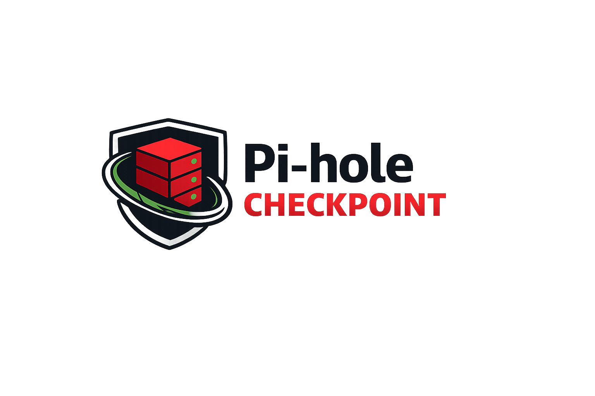

<p align="center">
  
</p>

# Pi-hole Checkpoint

A web application for backing up Pi-hole v6 instances via the Teleporter API. Runs as a single Docker container with a web UI and automated scheduler.

**Requires Pi-hole v6** - Uses session-based authentication (not compatible with v5 API keys).

## Features

- Automated scheduled backups (hourly, daily, or weekly)
- Manual backup on demand
- One-click restore to Pi-hole
- Backup retention policies (by count and age)
- Failure notifications (Discord, Slack, Telegram, Pushbullet, Home Assistant)
- Encrypted password storage
- Optional web UI authentication

## Generate Keys

```bash
# Generate SECRET_KEY
openssl rand -base64 48

# Generate FIELD_ENCRYPTION_KEY
python3 -c "from cryptography.fernet import Fernet; print(Fernet.generate_key().decode())"
```

## Quick Start

1. Create a `docker-compose.yml`:
   ```yaml
   services:
     pihole-checkpoint:
       image: ghcr.io/pihole-checkpoint/pihole-checkpoint:latest
       ports:
         - "8000:8000"
       volumes:
         - ./data:/app/data
         - ./backups:/app/backups
       environment:
         - SECRET_KEY=your-random-secret-key
         - FIELD_ENCRYPTION_KEY=your-fernet-encryption-key
         - TIME_ZONE=UTC
       restart: unless-stopped
   ```

2. Start the container:
   ```bash
   docker compose up -d
   ```

3. Open http://localhost:8000 and configure your Pi-hole connection.

## Environment Variables

| Variable | Required | Description |
|----------|----------|-------------|
| `SECRET_KEY` | Yes | Django secret key |
| `FIELD_ENCRYPTION_KEY` | Yes | Fernet key for encrypting Pi-hole passwords |
| `TIME_ZONE` | No | Scheduler timezone (default: UTC) |
| `REQUIRE_AUTH` | No | Enable web UI password protection (default: false) |
| `APP_PASSWORD` | No | Password for web UI when `REQUIRE_AUTH=true` |
| `DEBUG` | No | Enable debug mode (default: false) |
| `ALLOWED_HOSTS` | No | Comma-separated allowed hosts (default: *) |

## Notifications

Get notified when backups fail. Configure via environment variables:

| Variable | Description |
|----------|-------------|
| `NOTIFY_ON_FAILURE` | Enable failure notifications (default: true) |
| `NOTIFY_ON_SUCCESS` | Enable success notifications (default: false) |
| `NOTIFY_DISCORD_ENABLED` | Enable Discord notifications |
| `NOTIFY_DISCORD_WEBHOOK_URL` | Discord webhook URL |
| `NOTIFY_SLACK_ENABLED` | Enable Slack notifications |
| `NOTIFY_SLACK_WEBHOOK_URL` | Slack webhook URL |
| `NOTIFY_TELEGRAM_ENABLED` | Enable Telegram notifications |
| `NOTIFY_TELEGRAM_BOT_TOKEN` | Telegram bot token |
| `NOTIFY_TELEGRAM_CHAT_ID` | Telegram chat ID |
| `NOTIFY_PUSHBULLET_ENABLED` | Enable Pushbullet notifications |
| `NOTIFY_PUSHBULLET_API_KEY` | Pushbullet API key |
| `NOTIFY_HOMEASSISTANT_ENABLED` | Enable Home Assistant notifications |
| `NOTIFY_HOMEASSISTANT_URL` | Home Assistant URL |
| `NOTIFY_HOMEASSISTANT_WEBHOOK_ID` | Webhook ID (or use `_TOKEN` for API) |

## Data Storage

Backups and the database are stored in mounted volumes:

- `./data/` - SQLite database
- `./backups/` - Backup ZIP files

## Commands

```bash
# View logs
docker compose logs -f pihole-checkpoint

# Stop the application
docker compose down

# Rebuild after updates
docker compose up --build -d
```

## License

MIT
